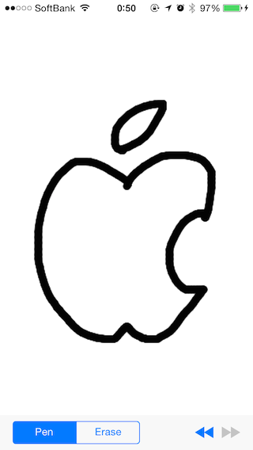
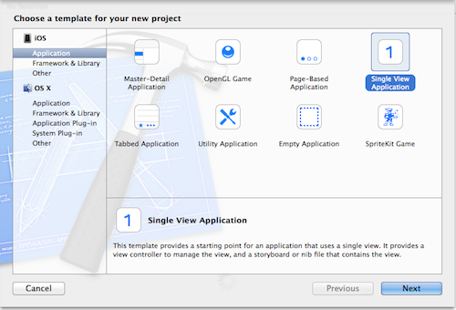
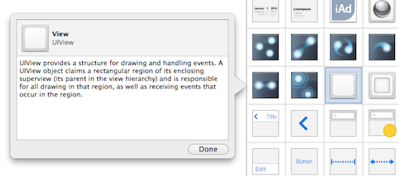
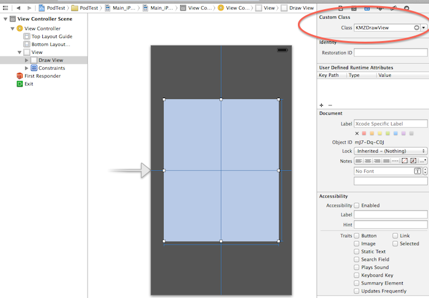
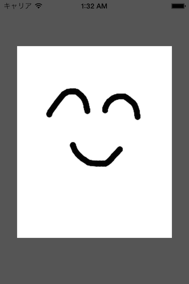

## What is KMZDrawView

Simple drawing view for iOS.

<p>
  
</p>

This library was made for [AnimeMaker](http://itunes.apple.com/app/animemaker/id306785702?mt=8).

## Features

- Draw with touches
- Erase line
- Undo/Redo
- Choose pen color (comming soon)
- Choose pen width (comming soon)
- Export to UIImage object

See [Example project](https://github.com/kenmaz/KMZDrawView/tree/master/ExampleProject).

## Install
Use CocoaPods.

```
pod 'KMZDrawView'
```

## Get Started

1. Create new Xcode project. <p></p>

1. Install KMZDrawView pod, and open workspace.

1. Open a storyboard, and add UIView as subview. <p></p>

1. Specify "KMZDrawView" as Custom Class to above view.<p></p>

1. Run iOS simulator. You can drawing now. **super eaaaaaaasy !!!** <p></p>

## Author

- Kentaro Matsumae (kenmaz)
  - [github](https://github.com/kenmaz)
  - [twitter](https://twitter.com/kenmaz)

## License

- KMZDrawView is available under the [MIT license](https://raw.githubusercontent.com/kenmaz/KMZDrawView/master/LICENSE). 
